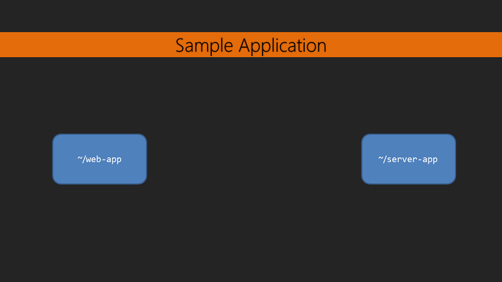

# Mastering TypeScript - Slice-it Pizza Sample Application



Slice-it Pizza is a simple food order management system.

It allows the user to input food items and orders containing specific food items.

## Recommended Text Editor

This code is designed to be used with [Visual Studio Code](https://code.visualstudio.com/). It's free and runs on Windows, OS X, and Linux.

Individually open up the `web-app` folder and `server-app` folder.

## Setup

Download and install [Node.js 4.1+](https://nodejs.org/en/).

In the `server-app` run:

```bash
~/server-app> npm install
~/server-app> gulp
~/server-app> npm start
```

Then in the `web-app` run:

```bash
~/web-app> npm install
~/web-app> gulp
~/web-app> npm start
```

* `npm install` - Installs the application dependencies
* `gulp` - Builds the application
* `npm start` - Starts the application

Make sure to start the `server-app` before running the `web-app`. Otherwise the `web-app` will have nothing to connect to.

## server-app

Listens for requests to list/insert/update/remove food items and orders from a database.

See `~/server-app/readme.md` for more details.

## web-app

Interacts with the server-app to list/insert/update/remove food items and orders.

The user is displayed information and they can view/add/update/remove food items and orders.

See `~/web-app/readme.md` for more details.

## Section 8, Video 3 - Code Generation

More information in Section 8, Video 3 on Code Generation.

Code is generated from the `FoodItemRoutes` and `OrderRoutes` classes in the `server-app` to the
`ServerFoodItems` and `ServerOrders` classes in the `web-app`, respectively. Other related files are
also copied to the `web-app` from the `server-app`.

* Code generation: `~/server-app/src/routes/food-item-routes.ts` -> `~/web-app/src/scripts/server/server.ts` as `ServerFoodItems`
* Code generation: `~/server-app/src/routes/order-routes.ts` -> `~/web-app/src/scripts/server/server.ts` as `ServerOrders`
* Copied files: `~/server-app/src/models/*` -> `~/web-app/src/scripts/server/*`

Code generation and copying happens when running the `gulp copy-server-files` or just `gulp` command is run in the `~/server-app` folder.
It does this by using an experimental library called [server-bridge](https://github.com/dsherret/server-bridge), which gets type information from
the code by using another experimental library called [ts-type-info](https://github.com/dsherret/ts-type-info) then writes some code the
`web-app` can use to easily interact with the server.
